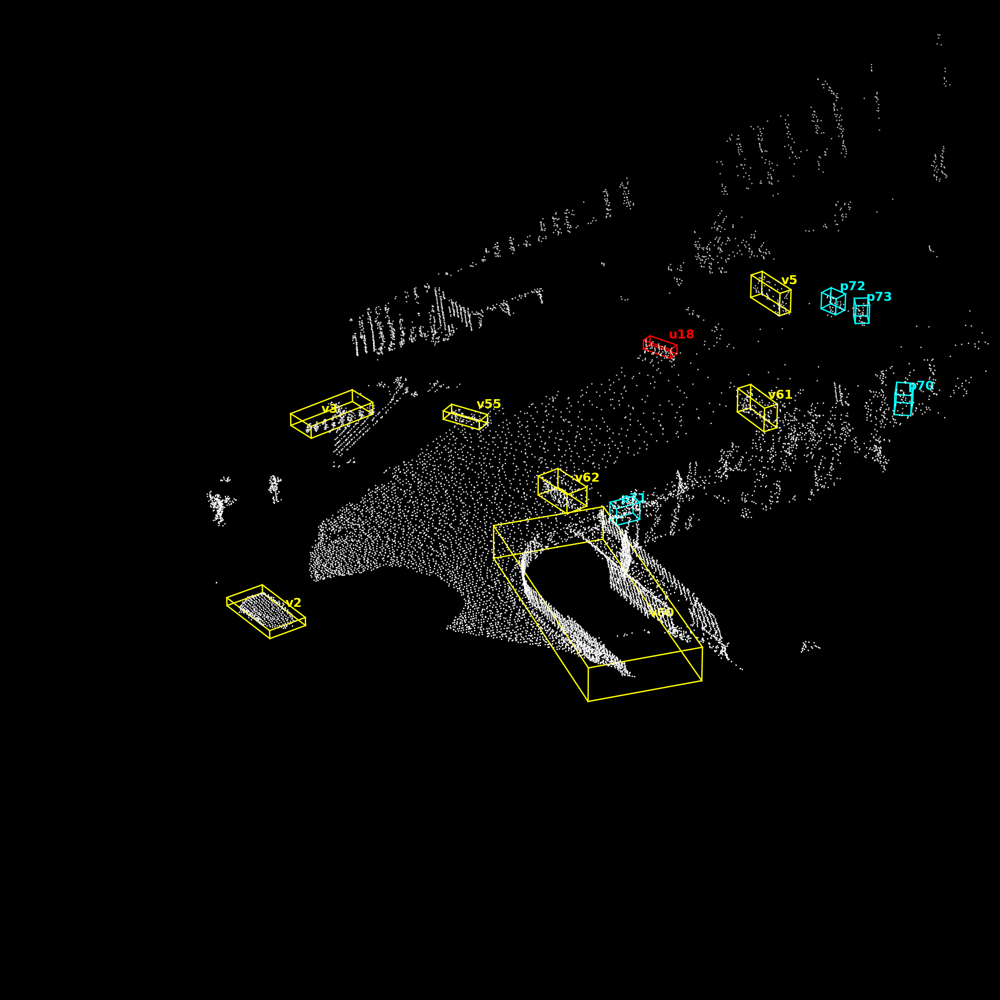
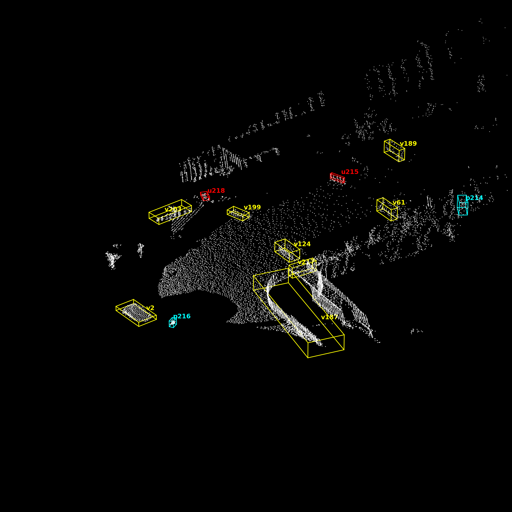
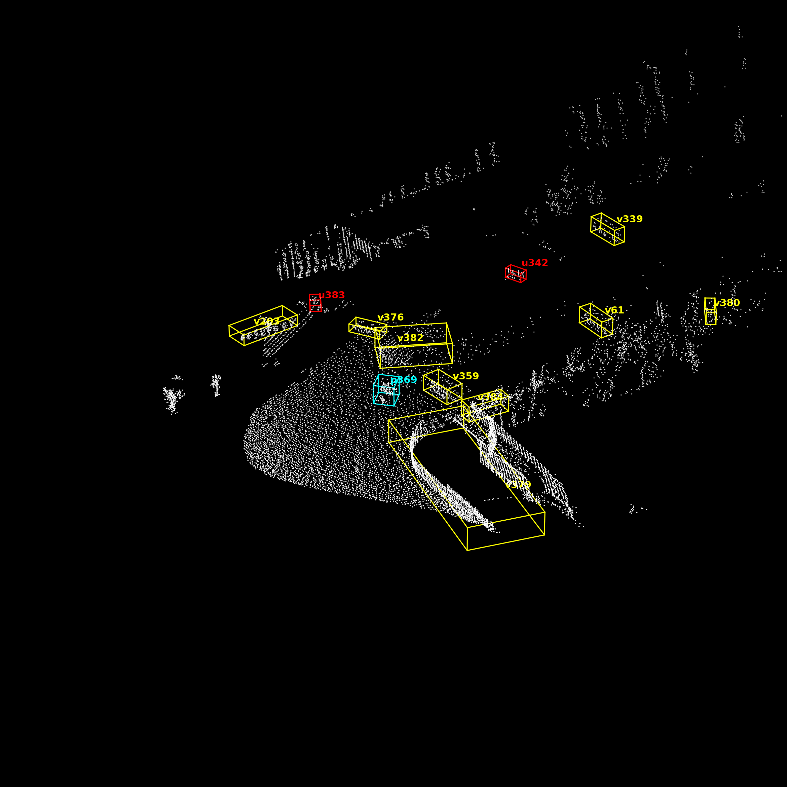
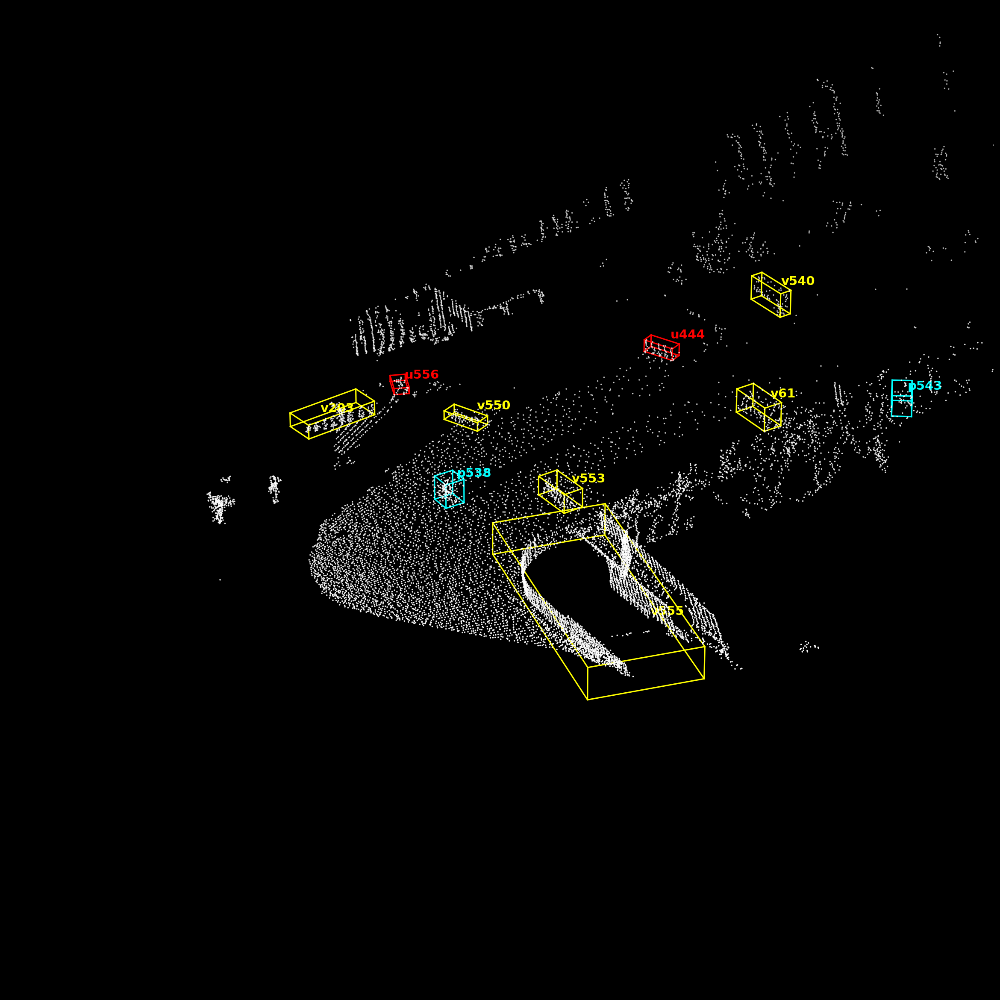
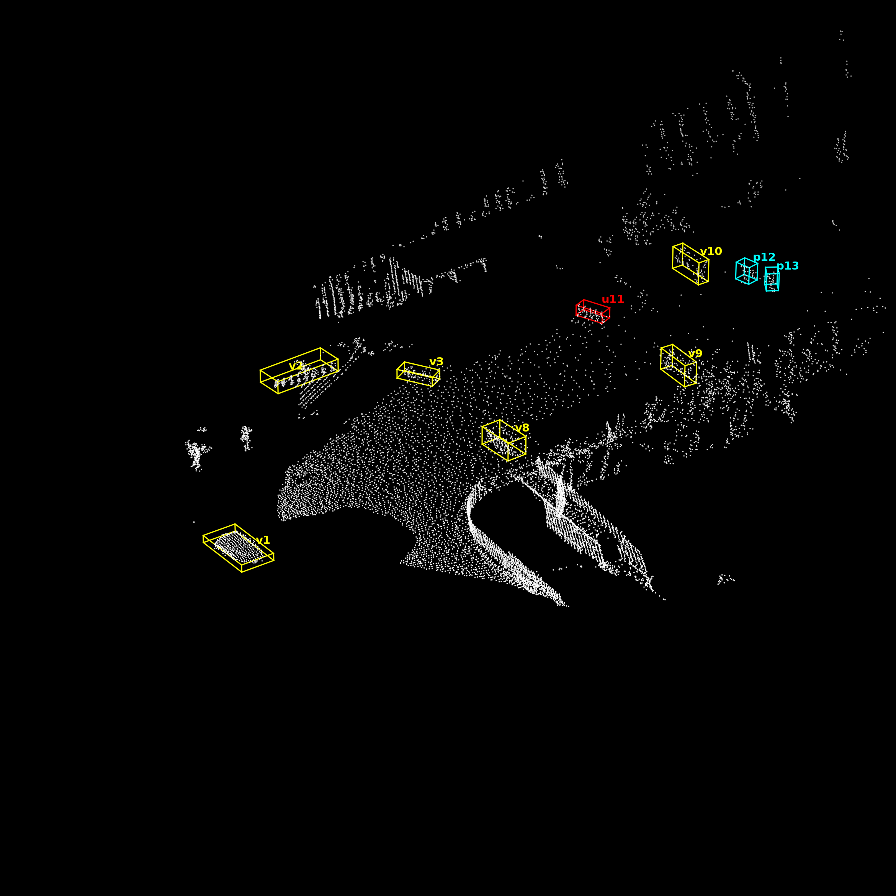
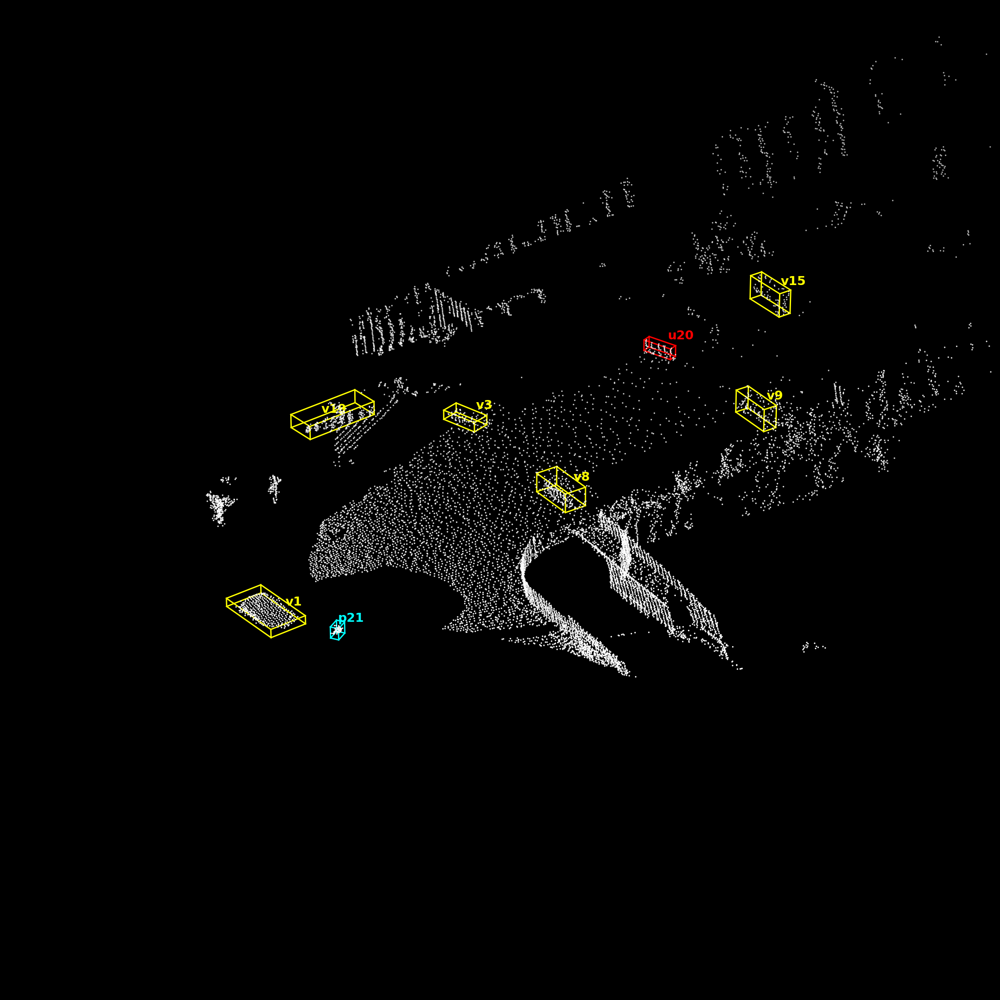
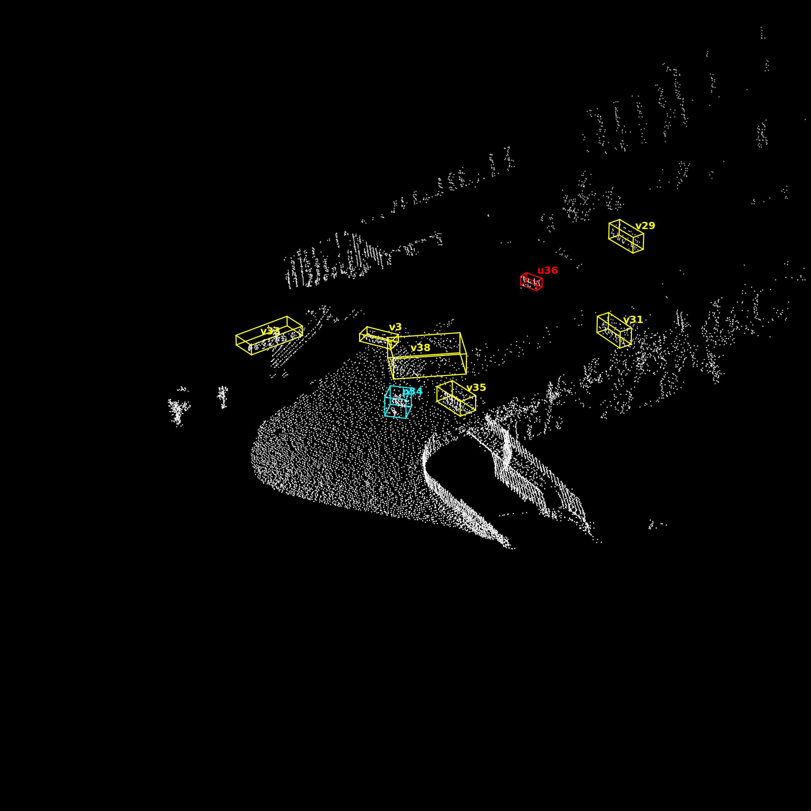
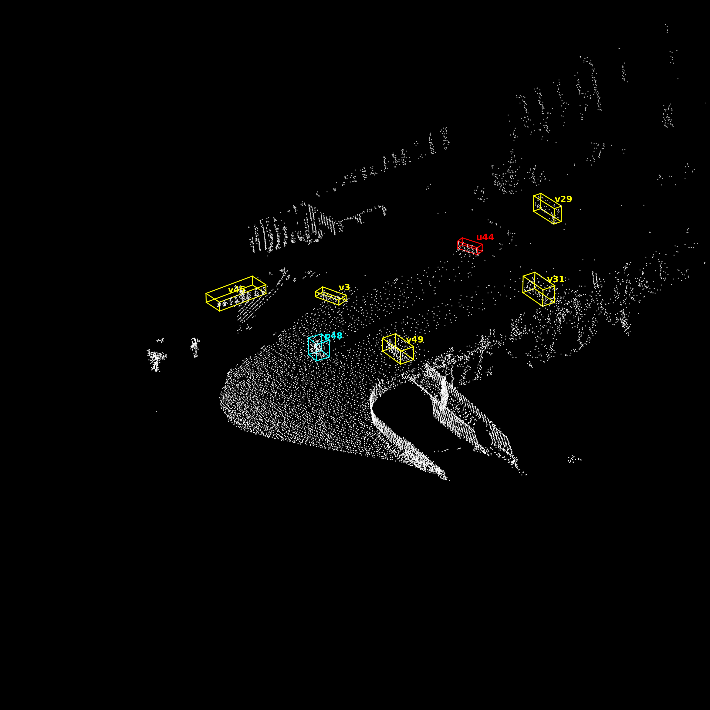

# LiDAR data processing for car and pedestrian detection/ tracking

Name: Hoang An Pham

Sudent id: 10245923

Language programming: Python

The training data is a private data provided by the university and because this repository is used for the assignment, please extract all the training csv files (from frame 1849 to 2566) under this folder:
```
object_detection_tracking/
                          |___data_IU_final/
                                |___raw_data_consecutive/
                                    |___192.168.26.26_2020-11-25_20-01-45_frame-1849.csv
                                    |___192.168.26.26_2020-11-25_20-01-45_frame-1850.csv
                                    |___ ...                   
```
## 1. Introduction
We implement an algorithm (no deep learning model) to detect and track multiple objects on the road by following steps: 
- First we use RANSAC method to separate the ground point cloud from object above the ground (like houses, car, pedestrian, trees…)
- Second, the DBSCAN method is used on the object points cloud to create bounding boxes on clustered points and filter them to detect 3 different type of objects (car, pedestrian and unknown objects)
- Finally, we apply Hungarian algorithm for multiple objects tracking task.

Figure 1: Full training pipeline


File structure:

- lidar.ipynb: this file is used for testing function only

- sanity_check.ipynb: this file is used for data assessment and sanity check

- train.py: this is the main file for training.

## 2. Software requirement and libraries

To implement the code, we recommend using operation system: 
- Linux operation
- At leaset 4GB ROM for storage
- Library: Open3D

## 3. Main function
This section will explain the main function used in the pipeline, do not execute.
1. To downsample the cloud point and perform RANSCAN, we can adjust the distance_threshold to set how far the point is to the plane to be considered as ground points:
```
pcd = pcd.voxel_down_sample(voxel_size=0.1)

# 3. RANSAC Segmentation to identify the largest plane (in this case the ground/road) from objects above it
plane_model, inliers = pcd.segment_plane(distance_threshold=0.2, ransac_n=3 num_iterations=150)
```

2. To perform DBSCAN 
```
np.array(outlier_cloud.cluster_dbscan(eps=0.4, min_points=7, print_progress=False))
```

3. The function filter_box(plane_model, inlier_cloud, outlier_cloud, labels) is used to make the bounding boxes.

4. The function assignIds is used to track ID of object using Hungarian algorithm, we can adjust the maxDistance between the centre of bounding boxes:
```
def assignIds(prevDf, currDf, next_id, maxDistance=4.0):
```

## 4. How to run

1. Clone the repository:
```bash
git clone https://github.com/Lk13Antkoo/object_detection_tracking_LiDAR.git
cd object_detection_tracking_LiDAR
```
2. Make sure that you put the consecutive csv files on the right folder

3. Create python virtual environment
```bash
python -m venv venv
source ./venv/bin/activate
```
4. Install libraries
```bash
pip install -r requirements.txt
```
5. Traning
   - If you want to run the training on just a few frames please adjust **list_frame = list(range(1849, 1853))** on train.py
   - For the entire screen object detection experiment: set X_positive = 250, X_negative = -250 and Y_positive = 250
   - For on the road object detection: set  set X_positive = 1.2, X_negative = -8 and Y_positive = 14.5
```bash
python train.py
```

# 5. Result

1. We conduct the first experiment to detect and track the objects in entire space and render every frame into a video. The full video can be download at: https://drive.google.com/file/d/1oUzFU0QH3C9kD1HV9dg9kROmvdYUFedu/view?usp=sharing

https://github.com/user-attachments/assets/a41984a2-13f6-4409-b296-3eb1f2fa4992


2. We conduct the second experiment to detect and track the objects on the road to give better result and more consistent tracking output, we also render every frame into a video. The full video can be download at: https://drive.google.com/file/d/1g7DnMPj7ZSkrP9i3nehU2QW-wMMTvqx3/view?usp=sharing


https://github.com/user-attachments/assets/61e09a24-e751-4caf-b052-57f45204365c


For comparing the 2 experiments, we show the 4 different time frames (1913, 2047, 2211 and 2381, respectively from left to right), these frames include multiple objects with crossing pedestrian, car approaching. In the first image, the algorithm can detect the pedestrians on the top-right corner which is far from sensor:
- For the first experiment
<p float="left">
  
  
  
  
</p>

- For the second experiment
<p float="left">
  
  
  
  
</p>

## Reference
This project is heavily based on Think Autonomous [Point Clouds Conqueror Course](https://courses.thinkautonomous.ai/point-clouds) and [Open3D official documentation](https://www.open3d.org/docs/release/getting_started.html). Additional references include [Think Autonomous Point Cloud Starter Code](https://github.com/Jeremy26/point_cloud_course) and [Open3D Official Repository](https://github.com/isl-org/Open3D).
